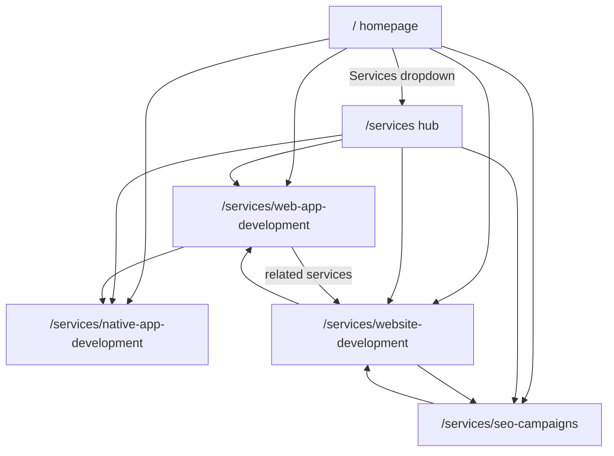

# Four service areas with dedicated SEO pages

The site is currently a one-page hash layout. Primary services in [`src/lib/content.ts`](src/lib/content.ts) are Web Design, SEO, Digital Strategy, and Paid Media. Those last two drop as primary offerings. Nav, footer, and homepage cards all point at `#services`.

## Information architecture

**Slugs** (keyword-rich, nested under `/services`):

- `/services/web-app-development`
- `/services/native-app-development`
- `/services/website-development`
- `/services/seo-campaigns`
- `/services` hub (overview + four cards) so the navbar parent has a real destination

**Homepage** keeps a `#services` section as a 2x2 of equal cards that link to the four pages (no more featured-bento + Digital Strategy / Paid Media). Flight-check CTA sits full-width under the grid.

**Copy distinction** will be explicit on both the website and web-app pages: websites are marketing/content destinations (CMS, SEO, conversion); web apps are authenticated, data-driven products (dashboards, portals, SaaS). Native covers iOS and Android, with React Native as the default cross-platform path.

## Content model

Add [`src/lib/services.ts`](src/lib/services.ts) as the source of truth so [`src/lib/content.ts`](src/lib/content.ts) does not balloon. Each service includes:

- `slug`, `title`, `shortTitle`, `navLabel`, `icon`
- SEO fields: `metaTitle`, `metaDescription`, `keywords`, canonical path
- Page body: H1, lede, who-its-for, problems, deliverables, process, differentiators, Houston geo copy
- `faqs[]` (long-tail questions)
- `relatedSlugs[]` and `relatedProjectIds[]`

Update [`src/lib/content.ts`](src/lib/content.ts):

- Replace the four homepage `services` entries with the new set (ids matching slugs)
- Point `footerNav.services` at the four routes
- Tag existing projects with `serviceIds` so related work can filter (e.g. Nova Fitness → web app; Orbital/Meridian → website; Bayou/Gulf Coast → SEO). Native page links adjacent web-app work until a native case study exists
- Remap `projectCategories` toward the new focus where it still reads well

## Routing and chrome

Today Navigation/Footer only live on the homepage; legal pages use a thin header. Service pages need the full marketing chrome.

- Add [`src/app/services/layout.tsx`](src/app/services/layout.tsx) with `Navigation` + `Footer` (same pattern as the homepage)
- [`src/app/services/page.tsx`](src/app/services/page.tsx) — hub with unique H1/metadata
- [`src/app/services/[slug]/page.tsx`](src/app/services/[slug]/page.tsx) — `generateStaticParams` + `generateMetadata` from the content file; `notFound()` on unknown slugs

**Make nav multi-page.** Hash links like `#houston` break on service pages. Change:

- Logo → `/`
- Section links → `/#houston`, `/#work`, `/#process`, `/#testimonials`, `/#contact`
- Scroll spy only when `usePathname() === "/"`
- Active state: section spy on home; on service routes, highlight Services

Update [`src/components/Footer.tsx`](src/components/Footer.tsx) `FooterLink` to use `next/link` for internal paths (it already uses raw `<a>` for hashes, which is fine for `/#process`).

## Services dropdown

In [`src/components/Navigation.tsx`](src/components/Navigation.tsx):

**Desktop:** “Services” is a link to `/services` with a chevron. Hover or click opens a panel listing the four pages (icon + title + one-line descriptor). Keyboard: `aria-expanded`, Escape, click-outside. Active pill when pathname starts with `/services`.

**Mobile:** Services row expands to the four links (plus “All services”), then the remaining section links. Close the sheet on navigate.

## Service page layout (SEO-first)

Shared server-rendered template in something like [`src/components/services/ServicePage.tsx`](src/components/services/ServicePage.tsx), with client islands only for FAQ accordion and existing `Reveal` motion.

Each page will include:

1. Breadcrumbs (`Home / Services / {name}`)
2. Unique H1 targeting the primary keyword + Houston
3. Lede + primary CTA (`/#contact` or mailto)
4. Who it’s for / problems
5. What’s included (deliverable chips/grid)
6. How we deliver (service-specific process, not a copy of the homepage)
7. Differentiation block (especially website vs web app)
8. Related work from tagged projects
9. FAQ accordion
10. Related services internal links
11. Existing [`CTA`](src/components/CTA.tsx)

**On-page SEO mechanics** (App Router `metadata` API, matching [`src/app/layout.tsx`](src/app/layout.tsx) and privacy page):

- Unique `title`, `description`, `keywords`, `alternates.canonical`
- Open Graph / Twitter using the title template already in root layout (`%s | Web Marketing Solutions`)
- JSON-LD: `Service` (provider = existing ProfessionalService), `BreadcrumbList`, `FAQPage`
- Hub JSON-LD: `ItemList` of the four services

**Sitewide SEO updates:**

- [`src/app/sitemap.ts`](src/app/sitemap.ts) — add `/services` and the four slugs (`priority: 0.8`)
- Root [`src/app/layout.tsx`](src/app/layout.tsx) — refresh `knowsAbout`, default description/keywords so they match the four offerings (drop Paid Media / Digital Strategy as primary)

Homepage [`Services.tsx`](src/components/Services.tsx): wrap each card in `Link`, 2×2 grid, keep spotlight hover, point the arrow at the dedicated page.

## Out of scope

- No rewrite of Hero, Houston, Process, or Testimonials beyond link/nav compatibility
- No new contact form (existing mailto CTA stays)
- Native stack in copy: iOS, Android, and React Native — not Flutter-only unless you want that later
